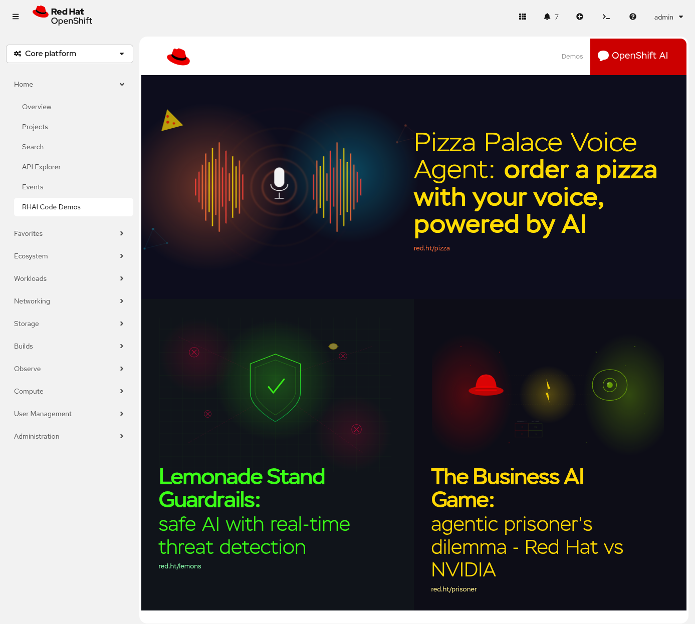

# RHAI Code Demos Web Console Plugin

On a 4.10+ OpenShift cluster, deploy this dynamic console plugin:

```bash
oc process -f template.yaml \
  -p PLUGIN_NAME=rhai-code-demo-plugin \
  -p NAMESPACE=rhai-code-demo-plugin \
  -p IMAGE=quay.io/eformat/rhai-code-demo-plugin:latest \
  | oc create -f -
```

```bash
oc patch consoles.operator.openshift.io cluster \
  --patch '{ "spec": { "plugins": ["rhai-code-demo-plugin"] } }' --type=merge
```

OR if using a GitOps approach and kustomize:

```bash
oc apply -k ./gitops
```



## Build image locally

You can build it locally using:

```bash
yarn install
podman build -t quay.io/eformat/rhai-code-demo-plugin:latest .
podman push quay.io/eformat/rhai-code-demo-plugin:latest
```
